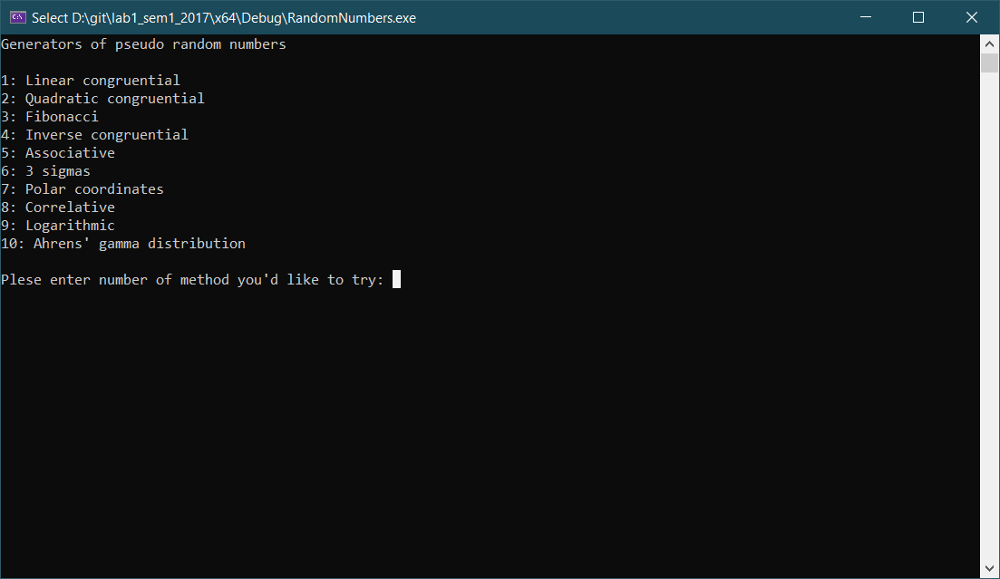

# Generators of pseudo-random numbers

This labwork implements 10 different generators of pseudo-random numbers that correspond to 3 different distributions:

 1. Linear congruential
 2. Quadratic congruential
 3. Fibonacci
 4. Inverse congruential
 5. Associative
 6. 3 sigmas
 7. Polar coordinates
 8. Correlative
 9. Logarithmic
 10. Ahrens' gamma distribution

Methods 1-5 implement linear distribution, 6-8 normal distribution, and 9-10 exponential.

## How to launch
In order to test the labwork, you need MS Visual Studio C++ installed, then clone the repository using 

    > git clone https://github.com/Via-R/lab1_sem1_2017.git

Then open the .sln file with MS Visual Studio and launch the project. You will be prompted which method you would like to test, and after you choose one of them, the program will generate 10000 pseudo-random numbers using the chosen method, and then it will show how much of them lie in which segment of a given interval in percents: 

 - Methods 1-5: interval [0,1], 10 segments
 - Methods 6-8: interval [-3,3], 24 segments
 - Methods 9-10: interval [0,100], 100 segments
 
In the end there also will be a number that represents the sum of all percentage to show how many generated numbers got into the desired interval.